# celular_coverage_prediction
I've done this for study purpose at the end of my engineering undergraduation in 2017. This code is free for any use.
I'VE TESTED IN MATLAB 2018a and 2016a versions.
I provided a dted file as example, if you use yours, remember to look at the scripts to change latlong links infos and the latlong boundaries/limits.
The ellapsed time is based in a 4th generation Intel I7 notebook. The scripts takes a bit time to run because all of the calculus are done with matrices.

## Description

Matlab set os scripts to predict a cellphone coverage area using a isotropic antenna with only free space loss and considering also diffraction loss using the Epstein-Peterson method.
Also a Script to calculate fresnel elipsoid, elevation path, received power and total loss between two radio links.

This Scripts does not utilize any info about constructions/building heights, just terrain elevation, if you have some infos of that you can use a dted file with those infos or utilize a matrix losses based in cluster infos like urban, semi-urban, dense urban or rural areas...

Its possible to change this script to consider a directional antenna instead of a isotropic one, just create a matrix with weights and do some planification (radius to distance) or other method to attenuate the signal in some directions.

## Scripts Explanation

plot_google_map.m
```
This method script is optional. It is used as a background just for a pleasant background for data visualization.
this script was made by Zohar Bar-Yehuda, i use it to plot the sunrounding area of the link. It will automatically print based on the latlong dataset in the current plot, not need to pass any parameter.

All scripts are fully commented in english.
```

link_calculation.m
```
this script will calculate and plot the fresnel elipsoid, elevation path, received power and total loss between two radio links.
based in 4 parameters, frequency, transmission power transmitter antenna gain and receiver antenna gain
```

celular_prediction.m
```
This script will calculate and plot a celular coverage of a base station with free space loss only (ignoring the terrain elevation) and with diffraction losses (considering the terrain elevation) based on the Epstein-Peterson method. It's possible to utilize other models like Okumura-Hata model and it can be extendable to use a loss matrix based in cluster area, like urban, rural, dense urban etc...
```

epstein_peterson.m
```
This function script calculate the diffraction loss based in the Epstein-Peterson method.
```

fresnelCS.m
```
This function script calculate the fresnel cosine and sine integrals. This script was made by Venkata Sivakanth Telasula. 

This script is optinal, it can be used in the link_calculation.m. I didn't not used it in my final code, i've used an aproximation method.
But if you wish to use it, just go to the link_calculation.m, remove/comment line #61 (diffraction_loss=...), and place this:

[FresnelC, FresnelS] = fresnelCS(Vo)
 diffraction_loss = diffraction_loss + -20*log10((1/sqrt(2))*sqrt((0.5 - FresnelC)^2 + (0.5 - FresnelS)^2));
```

fuse_2images.m
```
This function script fuse two images and it allows to set alpha channel, i used that to plot fuse the colormap with the map background. Because of a limitation of matlab, once i use a colormap plot i cant change it alpha and fuse with other image, like i've done for example with the plots with received power boundaries.
This script was made by Athi Narayanan S, but i've simplified it a lot to use in this project
```

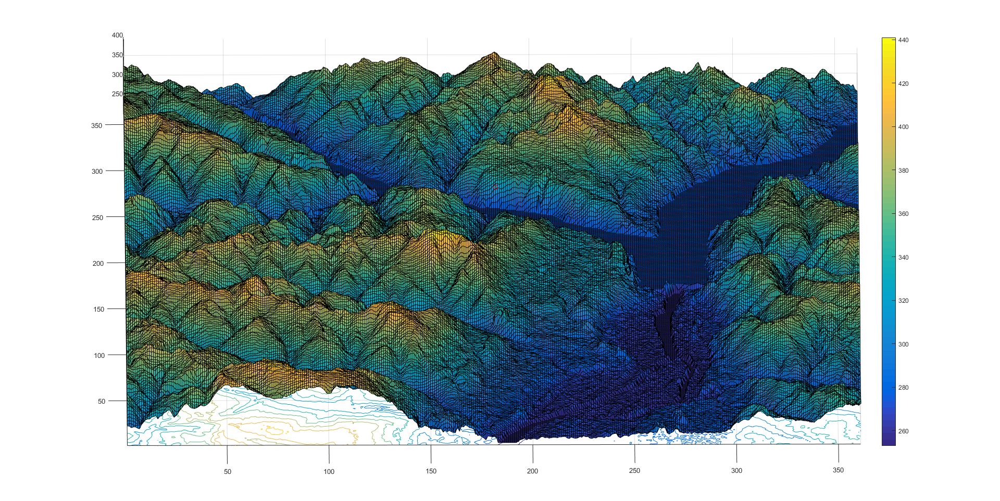

```
This image shows a 3d View of the sunrounding area of the links.
```

## Outputs and Results

 - [`Link Calculation Script`](#link_calculation) - estimate elapsed time +- 3minutes


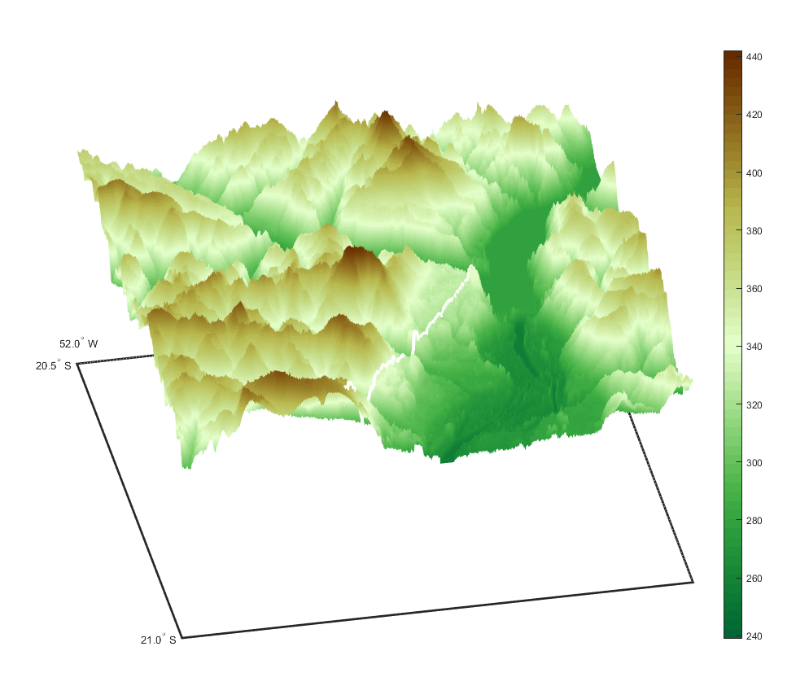

```
This image show the terrain with altitude/elevation used as example.
```

 
 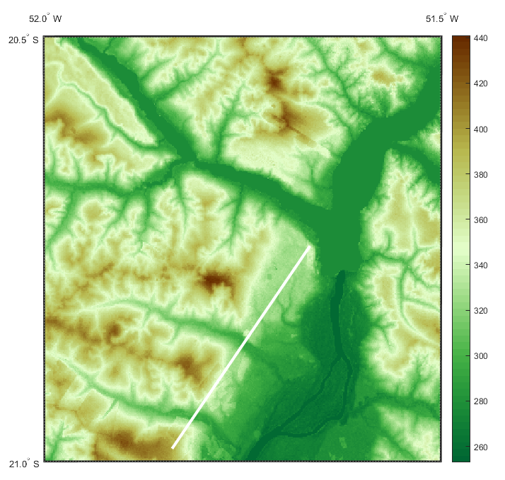

```
This image shows a 3d View of the sunrounding area of the links.
```

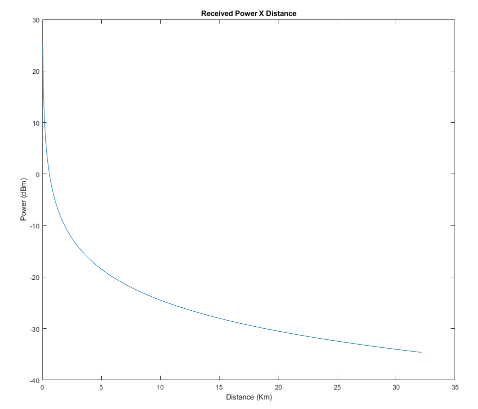

```
This image shows the received power acording to the distance between the links.
```

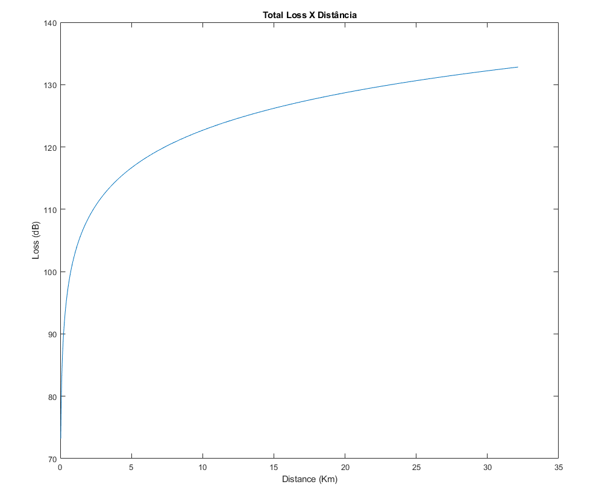

```
This image shows the received total loss acording to the distance between the links.
```

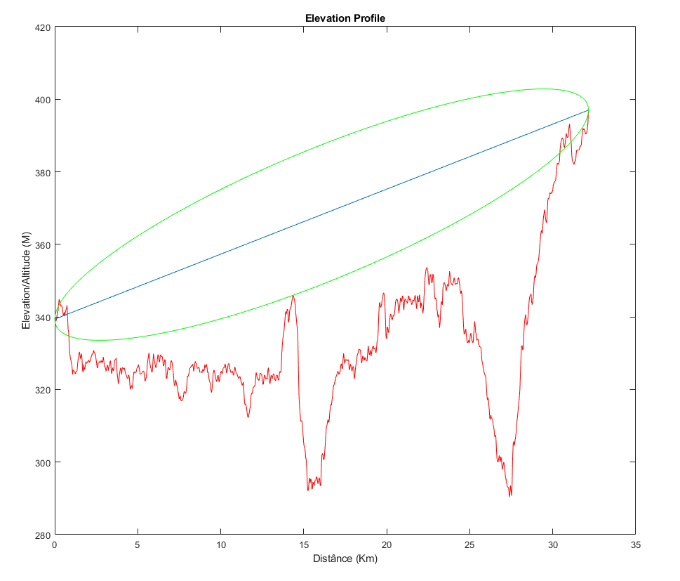

```
This image shows the elevation profile between the two links including the fresnel ellipsoid.
```

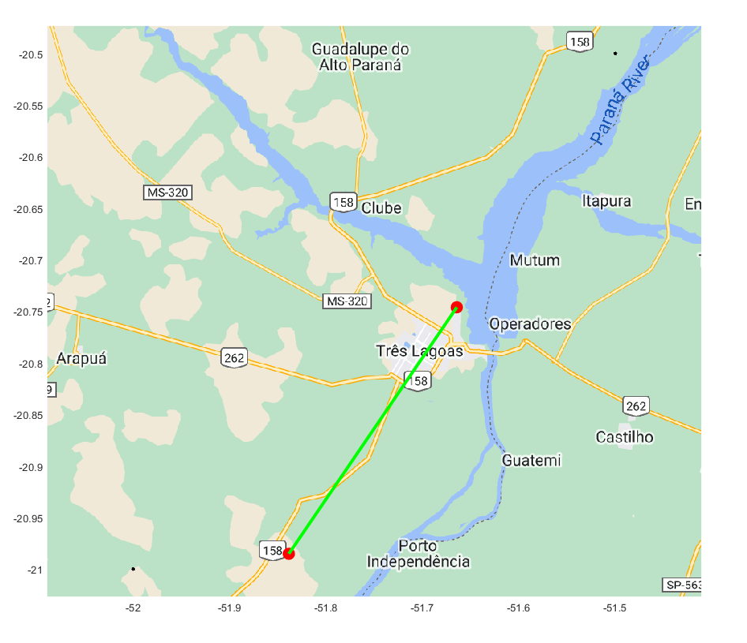

```
This image shows the link path of between the two path plotted in a map.
```

 - [`Celular Prediction Script`](#celular_prediction)  +- 12minutes


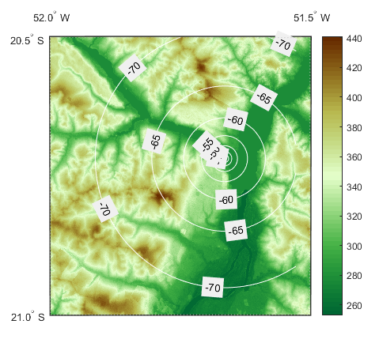

```
This image shows a 2d Elevation map with the received power bounderies considering only free space loss
```

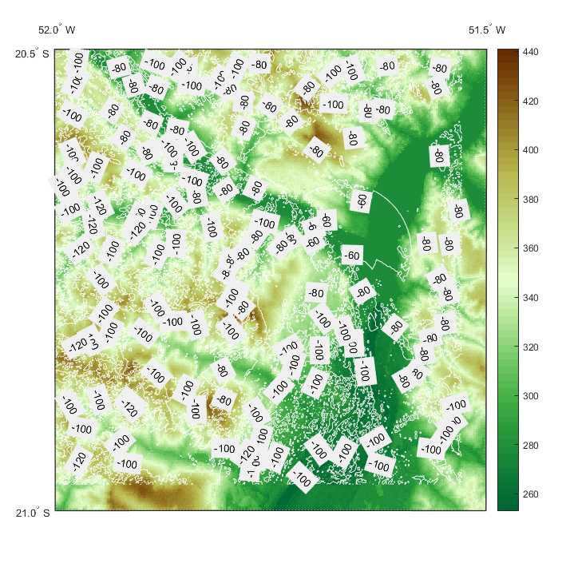

```
This image shows a 2d Elevation map with the received power bounderies considering diffraction calculated using the Epstein-Peterson method
```

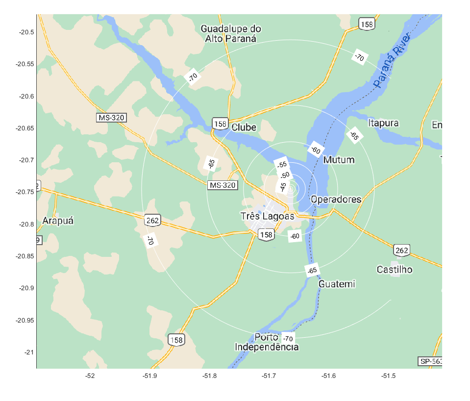

```
This image shows a google maps with the received power bounderies considering only free space loss
```

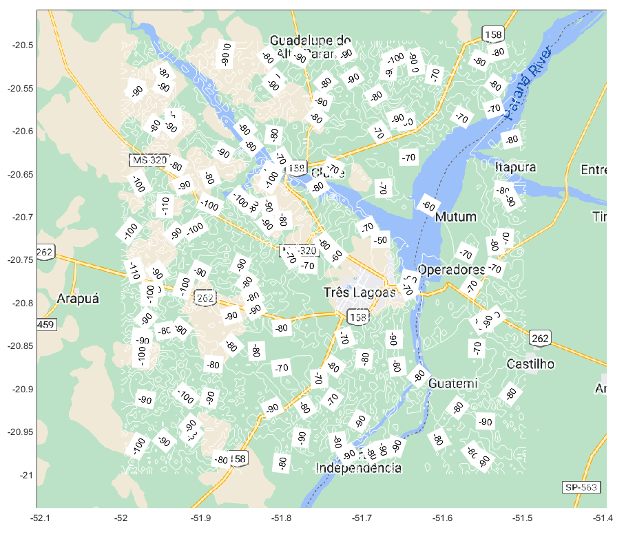

```
This image shows a google maps with the received power considering diffraction calculated using the Epstein-Peterson method
```

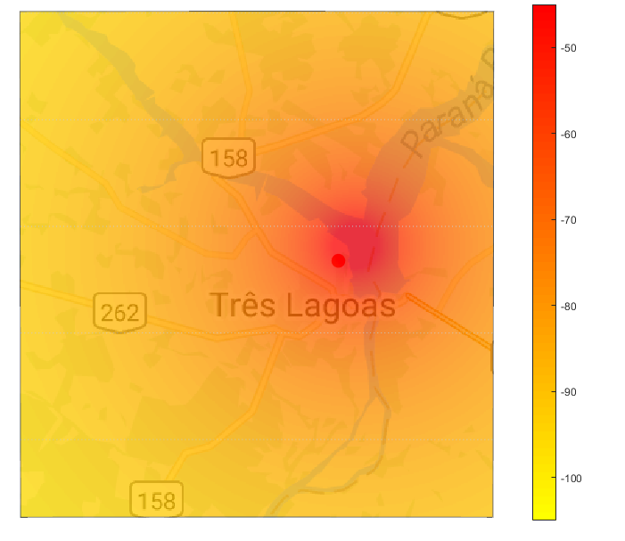

```
This image shows a google maps with the received power colormap considering only free space loss
```

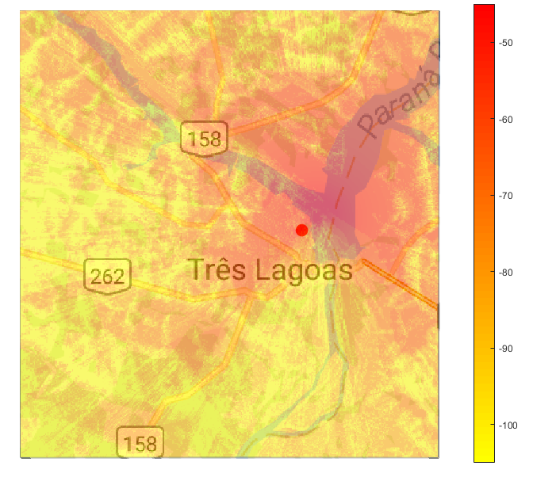

```
this image shows a google maps with the received power colormap considering diffraction calculated using the Epstein-Peterson method
```
 
 
